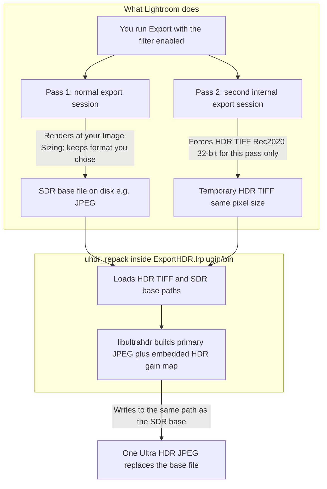

# lightroom-plugin-export-hdr

Lightroom Classic **export filter** (**Requires macOS 26 (Tahoe), ARM64**) plus `**uhdr_repack`**: one Ultra HDR (gain-map) **JPEG** from your normal export and an internal HDR TIFF, using [google/libultrahdr](https://github.com/google/libultrahdr).

## What it does

- Keeps **Image Sizing** and most export options for the main pass (SDR base, often JPEG).
- Runs a **second internal export** → temporary **HDR TIFF**, then `**ExportHDR.lrplugin/bin/uhdr_repack`** merges into one `**.jpg`** (Ultra HDR).
- Optional **Slicing** (`1:1` or `4:5`) keeps the full exported height, preserves the original Ultra HDR file, and writes numbered Ultra HDR slice JPEGs next to it (each with its own gain map).
- **Lightroom Classic 14+** — `[Info.lua](ExportHDR.lrplugin/Info.lua)` (`LrSdkMinimumVersion = 14.0`). Export filter: **Encode Ultra HDR JPEG (uhdr_repack)** (under plug-in **Ultra HDR Export**).

## How it works




1. **Pass 1** — **SDR base** (your File Settings format, usually JPEG) at destination, using your sizing and edits.
2. **Pass 2** — Same settings, extra export job → **32-bit HDR TIFF** (wide gamut / HDR display), same pixel size.
3. `**uhdr_repack`** — `**--hdr-tiff`**, `**--base`**, `**--out**` replaces the base path with the merged Ultra HDR JPEG.
4. **Logs** — `**uhdr_export_<timestamp>.log`** next to the export folder. **Save debug copies** (optional) → `**_uhdr_sdr`** / `**_uhdr_hdr`** before overwrite.

## How to use

1. **Bundle** — Repo root: `./scripts/bundle_uhdr_for_plugin.sh` → `**ExportHDR.lrplugin/bin/uhdr_repack`** + `**.dylib`** (gitignored). Optional: `brew install dylibbundler`. Pre-built zips (**macOS 26 (Tahoe), ARM64**, same bundle) ship from [GitHub Releases](https://github.com/karachungen/lightroom-plugin-export-hdr/releases) when CI runs on relevant changes.
2. **Install** — **File → Plug-in Manager → Add** → `[ExportHDR.lrplugin](ExportHDR.lrplugin)`
3. **Export** — Set **Destination** and **Image Sizing** as usual, then wire up the filter:
  - In the Export dialog, open **Post-Process Actions** (wording may vary slightly by Lightroom version; same area as post-processing / export filters).
  - Click **Add** and choose **Ultra HDR Export** → **Encode Ultra HDR JPEG (uhdr_repack)**.
  - If Lightroom shows **Install** for that action, click it so the plug-in’s options load for this export.
  - Expand or select the new action so the **Encode Ultra HDR JPEG (uhdr_repack)** section appears; adjust **Base quality**, **Gain map Q**, **Slicing**, and other options there.
  - For `**.jpg`**, use **JPEG** in **File Settings**; do not use a manual 32-bit HDR TIFF as the main file.
4. **Develop** — **HDR** mode when the photo supports it.

## Build locally

**Plug-in** — from repo root:

```bash
./scripts/bundle_uhdr_for_plugin.sh
```

CMake **FetchContent** → `**tools/uhdr_repack/build/_deps/`** · **libjpeg** via `**FindJPEG`** (e.g. Homebrew **jpeg-turbo**) · optional `UHDR_USE_SYSTEM=1`, `UHDR_ROOT=...` · ship: **codesign** `**bin/uhdr_repack`** and `**bin/*.dylib`**

**Encoder** — from `tools/uhdr_repack`:

```bash
cd tools/uhdr_repack
cmake -S . -B build -DCMAKE_BUILD_TYPE=Release
cmake --build build
```

→ `**build/uhdr_repack**` · flags & `**--inspect**`: [tools/uhdr_repack/README.md](tools/uhdr_repack/README.md)