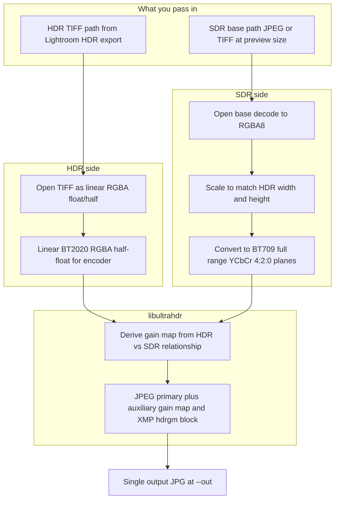

# uhdr_repack

CLI: **Lightroom HDR TIFF** + **SDR base** → one **Ultra HDR JPEG** (gain map + primary XMP) using [google/libultrahdr](https://github.com/google/libultrahdr), vendored via CMake **FetchContent** **`v1.4.0`**, **`UHDR_WRITE_XMP=ON`**.

**Platforms:**
- **macOS 26 (Tahoe), ARM64** — HDR/SDR ingest via Core Image (`.mm` loaders).
- **Windows x64** — HDR/SDR ingest via Windows Imaging Component (`.cpp` loaders).

## How it works



- **HDR path** — Core Image (macOS) or WIC (Windows) → **linear BT.2020** half-float for libultrahdr.
- **SDR path** — Resize to match, then **BT.709 YCbCr 4:2:0** for the SDR primary JPEG.
- **Encode** — Gain map + **XMP** (`hdrgm` / GContainer-style).

## Build

From **`tools/uhdr_repack`**. CMake 3.15+, C++17. macOS also uses Objective-C++. On macOS, libjpeg is provided by the system or Homebrew (**`brew install jpeg-turbo`**). On Windows, libjpeg-turbo is vendored automatically via libultrahdr **`UHDR_BUILD_DEPS`**. Use **CMake 3.15–3.31.x** on Windows (CMake 4.x fails on vendored libjpeg-turbo 3.0.1 until upstream updates; CI pins **3.31.6**). First configure downloads libultrahdr into **`build/_deps/`**.

**macOS:**

```bash
cd tools/uhdr_repack
cmake -S . -B build -DCMAKE_BUILD_TYPE=Release
cmake --build build
```

→ **`build/uhdr_repack`**

**Windows (x64, MSVC):**

```powershell
cd tools\uhdr_repack
# Developer shell or CI (Ninja + cl.exe on PATH):
cmake -S . -B build -G Ninja -DCMAKE_BUILD_TYPE=Release
cmake --build build

# Or with a full Visual Studio install:
cmake -S . -B build -G "Visual Studio 17 2022" -A x64
cmake --build build --config Release
```

→ **`build/uhdr_repack.exe`** (Ninja) or **`build/Release/uhdr_repack.exe`** (VS generator)

System libultrahdr instead of vendored:

```bash
cmake -S . -B build -DCMAKE_BUILD_TYPE=Release -DUHDR_USE_SYSTEM=ON -DUHDR_ROOT=/usr/local
cmake --build build
```

## Lightroom bundle

**Repository root (platform-specific):**

```bash
./scripts/bundle_uhdr_for_plugin.sh          # macOS arm64
```

```powershell
.\scripts\bundle_uhdr_for_plugin_windows.ps1  # Windows x64
```

Each script copies only that platform's binary and runtime libraries into **`ExportHDR.lrplugin/bin/`**. Plug-in flow: **[../../README.md](../../README.md)**

## Usage

```bash
./build/uhdr_repack --hdr-tiff export_hdr.tif --base export_sdr.jpg --out output_uhdr.jpg
```

**Options** — `--base-quality` (92), `--gainmap-quality` (85), `--gainmap-scale` (1), `--min-content-boost` (1.0), `--max-content-boost` (1000), `--target-display-peak` (1000 nits), `--monochrome-gainmap`, `--slice-aspect <none|1x1|4x5>`

### Optional slicing (`--slice-aspect`)

When set to `1x1` or `4x5`, the encoder still writes the full-frame Ultra HDR JPEG to `--out`, then creates **numbered slice files** next to it (e.g. `photo_1x1_01.jpg`, `photo_4x5_02.jpg`). Each slice keeps the **full exported height**; tile width is `H` (1:1) or `even floor(H×4/5)` (4:5). Equal-width tiles are packed left-to-right and **centered** when the image is wider than `n × tileWidth`.

Gain maps are **re-derived per slice** from identically cropped HDR TIFF + SDR base buffers (never by cutting an existing Ultra HDR JPEG). Pass a preserved SDR copy as `--base` if `--out` overwrites the original base file (the Lightroom plug-in does this automatically).

## `--inspect`

```bash
./build/uhdr_repack --inspect output_uhdr.jpg
```

**Prints** — dimensions, Ultra HDR yes/no, **`gainmap_size`**, 4:2:0 hints, MPF / **`primary_xmp`** / ISO APP2

## Lightroom inputs

1. HDR TIFF with HDR output on; align HDR and SDR edits (e.g. same virtual copy).
2. Same **pixel size** for both inputs (base is scaled to HDR if needed).
3. Primary **4:2:0**; gain map may differ — **`--inspect`** → **`primary_jpeg_420`** / **`gainmap_jpeg_420`**
4. **Odd dimensions** — If Lightroom exports an odd width or height (e.g. from Image Sizing or crop), the encoder crops one pixel from the right and/or bottom so both HDR and SDR match even dimensions required for 4:2:0. A line is written to stderr, e.g. `HDR dimensions cropped from 1291x1614 to 1290x1614 for 4:2:0 compatibility`.

## Test

Fixtures: **[../../test/README.md](../../test/README.md)** · repo root:

```bash
./scripts/run_uhdr_test.sh
```

```powershell
.\scripts\run_uhdr_test.ps1
```

Defaults → encode, **`--inspect`**, checks **`gainmap_size`** & **`primary_xmp`**
