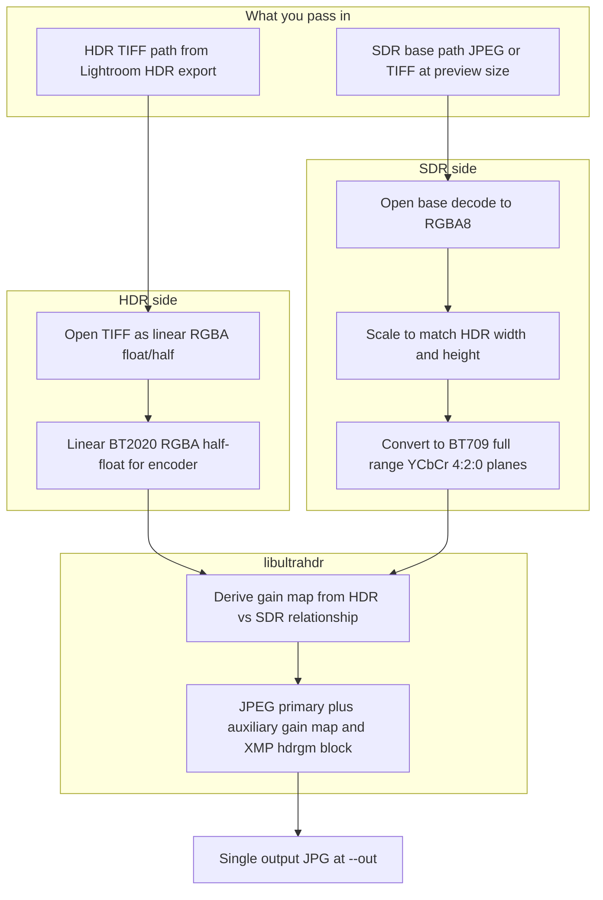

# uhdr_repack

CLI: **Lightroom HDR TIFF** + **SDR base** → one **Ultra HDR JPEG** (gain map + primary XMP) using [google/libultrahdr](https://github.com/google/libultrahdr), vendored via CMake **FetchContent** **`v1.4.0`**, **`UHDR_WRITE_XMP=ON`**.

**Platforms:**
- **macOS 26 (Tahoe), ARM64** — HDR/SDR ingest via Core Image (`.mm` loaders).
- **Windows x64** — HDR/SDR ingest via Windows Imaging Component (`.cpp` loaders).

## How it works


```mermaid
flowchart TB
  subgraph files [What you pass in]
    hdrPath["HDR TIFF path from Lightroom HDR export"]
    sdrPath["SDR base path JPEG or TIFF at preview size"]
  end

  subgraph hdrBranch [HDR side]
    hdrLoad["Open TIFF as linear RGBA float/half"]
    hdrBuf["Linear BT2020 RGBA half-float for encoder"]
    hdrLoad --> hdrBuf
  end

  subgraph sdrBranch [SDR side]
    sdrLoad["Open base decode to RGBA8"]
    sdrMatch["Scale to match HDR width and height"]
    sdrYcc["Convert to BT709 full range YCbCr 4:2:0 planes"]
    sdrLoad --> sdrMatch --> sdrYcc
  end

  subgraph libUhdr [libultrahdr]
    compute["Derive gain map from HDR vs SDR relationship"]
    mux["JPEG primary plus auxiliary gain map and XMP hdrgm block"]
    compute --> mux
  end

  hdrPath --> hdrLoad
  sdrPath --> sdrLoad
  hdrBuf --> compute
  sdrYcc --> compute
  mux --> outPath["Single output JPG at --out"]
```

- **HDR path** — Core Image (macOS) or WIC (Windows) → **linear BT.2020** half-float for libultrahdr.
- **SDR path** — Resize to match, then **Display P3 BT.601 YCbCr 4:2:0** for the SDR primary JPEG (Display P3 ICC from libultrahdr).
- **Encode** — Gain map + **XMP** (`hdrgm` / GContainer-style). Primary and gain-map JPEGs are **progressive**. Primary (SDR) XMP also gets **xmpRights** (`WebStatement` https://hdr.karachun.by/, `UsageTerms` GitHub repo).

## Build

From **`tools/uhdr_repack`**. CMake 3.15+, C++17. macOS also uses Objective-C++. libjpeg-turbo is vendored automatically via libultrahdr **`UHDR_BUILD_DEPS`** on both platforms (static link). Use **CMake 3.15–3.31.x** on Windows (CMake 4.x fails on vendored libjpeg-turbo 3.0.1 until upstream updates; CI pins **3.31.6**). First configure downloads libultrahdr into **`build/_deps/`**.

**Canonical configure/build** (shared by local builds and GitHub Actions) — use [CMakePresets.json](CMakePresets.json):

```bash
cd tools/uhdr_repack
cmake --preset macos-arm64-release -S .
cmake --build build
```

```powershell
cd tools\uhdr_repack
cmake --preset windows-x64-release -S .
cmake --build build
```

→ **`build/uhdr_repack`** (macOS) or **`build/uhdr_repack.exe`** (Windows, Ninja)

System libultrahdr instead of vendored:

```bash
cmake --preset macos-arm64-release -S . -DUHDR_USE_SYSTEM=ON -DUHDR_ROOT=/usr/local
cmake --build --preset macos-arm64-release
```

## Lightroom bundle

**Repository root** — full pipeline (build, bundle, smoke test, release zip):

```bash
./scripts/build_plugin.sh all          # macOS arm64
```

```powershell
.\scripts\build_plugin.ps1 all       # Windows x64
```

Legacy aliases (build + bundle only): `bundle_uhdr_for_plugin.sh` / `bundle_uhdr_for_plugin_windows.ps1`.

Each platform copies only that OS binary into **`ExportHDR.lrplugin/bin/`** (self-contained; no runtime `.dylib` / `.dll`). Plug-in flow: **[../../README.md](../../README.md)**

## Usage

```bash
./build/uhdr_repack --hdr-tiff export_hdr.tif --base export_sdr.jpg --out output_uhdr.jpg
```

**Options** — `--base-quality` (95), `--gainmap-quality` (95), `--gainmap-scale` (1), `--min-content-boost` (1.0), `--max-content-boost` (16), `--target-display-peak` (3250 nits), `--monochrome-gainmap`, `--slice-aspect <none|1x1|4x5|3x4|191x100>`, `--slice-count <N|max>` (default 1), `--crop-offset` (0.5), `--out-width <px>` (0 = native crop, capped at 2×; height follows aspect), `--gainmap-in`, `--watermark-config`, `--metadata-patch`

### Preview / edit (`--edit`)

Requires **Qt 6.11+** and a system webview:

- **macOS** — WKWebView (WebKit)
- **Windows x64** — WebView2 Evergreen runtime + static `WebView2LoaderStatic` at link time

The editor chrome is **embedded HTML/CSS/JS** (filmstrip, encode settings, gain-map painting, slice overlay). **Live HDR** and **Final** preview use a native `QRhiSwapChain` viewport (Metal EDR on macOS, Direct3D 11 scRGB/HDR on Windows) beside the web panel.

Release builds require a genuinely static Qt kit; prebuilt `aqt`/Homebrew Qt packages are
shared builds and are only suitable for local development:

```bash
./scripts/setup_qt_static.sh
export QT_STATIC_ROOT=$HOME/Qt/6.11.0-static
./scripts/build_plugin.sh build
```

The build fails if `UHDR_STATIC_QT=ON` and `otool`/`dumpbin` still finds a Qt dynamic
library. For a local shared-Qt build, configure with `-DUHDR_STATIC_QT=OFF`.

The editor provides an export filmstrip, SDR/Gain/HDR modes, encode settings, and slice overlays. Delivery presets: **Color map** (JPEG 95, RGB full-res Display P3 map, `--max-content-boost` 16 / 4 stops, 3250 nits, progressive), **Mono map** (JPEG 95, luma map at `--gainmap-scale 2`, `--max-content-boost` 4.92, `--monochrome-gainmap`), and **Custom** (unlocks the current values). A photo that is already 3:4, 4:5, 1:1, or 1.91:1 auto-selects that feed crop. Encode keeps the crop’s **native** pixels, capped at **2×** Instagram size (3:4 → 2160×2880). Sliders cannot go above 2× or below 1× (and never upscale). The editor warns if the aspect is outside **1.91:1–3:4** (Instagram will crop and HDR may drop). Uncheck Lightroom **Image Sizing** for camera-native pixels. Preview HUD warns only if the JPEG would exceed Instagram’s **8 MB** upload cap. **Gain** and **HDR** preview-encode the current photo. When `bridge.json` is present, the editor requests every missing HDR TIFF from Lightroom at open (the current filmstrip photo is rendered first). **Encode N photos** waits for any leftover TIFFs, then batch-encodes. Standalone `--edit` sessions that already include `hdr_tiff` paths work without Lightroom.

```bash
./scripts/run_uhdr_preview_demo.sh
# or:
./build/uhdr_repack --edit --session ../../test/ui/preview_session.json
```

Headless CI / encode-only builds can disable the GUI:

```bash
UHDR_ENABLE_GUI=OFF ./scripts/build_plugin.sh build
```


### Optional slicing (`--slice-aspect`)

When set to `1x1`, `4x5`, `3x4`, or `191x100`, the encoder cover-crops tiles of that aspect. Default output is the crop’s native size, capped at **2×** Instagram (2160-wide). `--out-width` (or the editor sliders) can request any even size in the 1×–2× range. Smaller crops are never upscaled. **Default is one slide** (`--slice-count 1`): leftover slack is centered (`--crop-offset 0.5`) and can be panned. `--slice-count max` packs as many matching tiles as fit, capped at 20 (Instagram gallery). Two or more slides write numbered files next to `--out` (e.g. `photo_4x5_01.jpg`); a single slide writes `--out` only.

Wide frames pack left-to-right at full height; tall frames pack top-to-bottom at full width. In the editor, if more than one matching frame fits, a gallery picker appears so you can choose the slide count before **Encode**. Session JSON uses `slice_count` (0 = max).

Gain maps are **re-derived per slice** from identically cropped HDR TIFF + SDR base buffers (never by cutting an existing Ultra HDR JPEG). Pass a preserved SDR copy as `--base` if `--out` overwrites the original base file (the Lightroom plug-in does this automatically).

## `--inspect`

```bash
./build/uhdr_repack --inspect output_uhdr.jpg
```

**Prints** — dimensions, Ultra HDR yes/no, **`gainmap_size`**, 4:2:0 hints, MPF / **`primary_xmp`** / ISO APP2

## Lightroom inputs

1. HDR TIFF with HDR output on; align HDR and SDR edits (e.g. same virtual copy).
2. Same **pixel size** for both inputs (base is scaled to HDR if needed).
3. Primary **4:2:0**; gain map may differ — **`--inspect`** → **`primary_jpeg_420`** / **`gainmap_jpeg_420`**
4. **Odd dimensions** — If Lightroom exports an odd width or height (e.g. from Image Sizing or crop), the encoder crops one pixel from the right and/or bottom so both HDR and SDR match even dimensions required for 4:2:0. A line is written to stderr, e.g. `HDR dimensions cropped from 1291x1614 to 1290x1614 for 4:2:0 compatibility`.

## Test

Fixtures: **[../../test/README.md](../../test/README.md)** · repo root:

```bash
./scripts/build_plugin.sh test
# or: ./scripts/run_uhdr_test.sh
```

```powershell
.\scripts\build_plugin.ps1 test
```

Defaults → encode, **`--inspect`**, checks **`gainmap_size`** & **`primary_xmp`**
